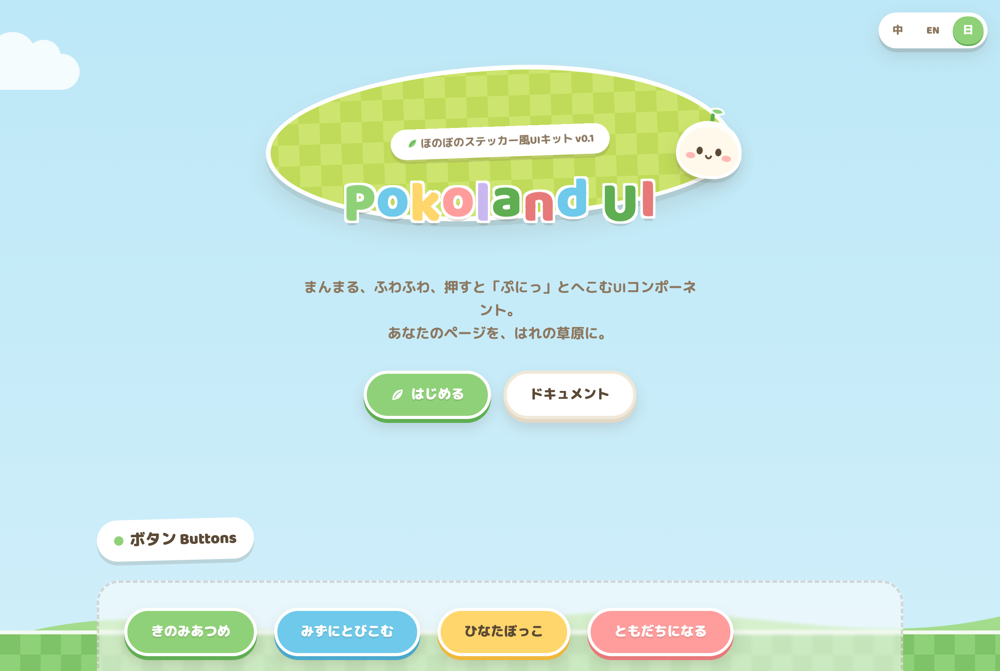

# 🏝️ Pokoland UI

**[English](README.md)** | **[简体中文](README.zh-CN.md)** | 日本語

> まんまる、ふわふわ、押すと「ぷにっ」となるステッカー風UIキット。

**フレームワーク非依存** — 純CSSなので React / Next.js / どこにでも使えます。

**ライブデモ:** https://heminghaoa.github.io/pokoland-ui/demo/ (右上で 中 / EN / 日 を切り替え)



## ✨ これはなに

ほのぼの生活シミュレーションゲームの空気感にインスパイアされた、ステッカー美学のWeb UIキットです:

- **太い白フチ** — どのコンポーネントも切り抜きステッカーのよう
- **ぷにぷに押し心地** — ボタンには物理的な厚みがあり、押すと本当に沈む
- **はれの草原パレット** — そらいろ / くさいろ / クリーム / バター / さんご
- **市松グラス & タイル地面のモチーフ** — ページ全体が小さな手作りの世界に
- **オリジナルアイコン(Pokoland Icons)** — 手描きSVG 20種、UI内に絵文字ゼロ
- **3言語デモ** — 中・英・日をその場で切り替え

## 🚀 はじめる

依存ゼロ。クローンして開くだけ:

```bash
git clone https://github.com/heminghaoa/pokoland-ui.git
open pokoland-ui/demo/index.html        # または: bun run dev
```

デザイントークンはすべて `:root` のCSS変数にあります。一行変えるだけでテーマが変わります。

## ⚖️ 名前、インスピレーションとIPについて

**Pokoland** という名前は日本語の擬音語「ぽこぽこ」に由来します — ぷにぷにボタンを押したときのやわらかい音感です。ほのぼのとした雰囲気は治愈系生活シムゲーム、特に *Pokémon Pokopia* にインスパイアされています。デザイン・配色・キャラクター・アイコン・文言はすべてオリジナルです。Pokoland UI は非公式のファンスピリットなプロジェクトであり、任天堂・株式会社ポケモンおよびいかなる商業IPとも無関係・無承認であり、公式アセットを一切含みません。コントリビューターも同じルールに従ってください。

## 📄 ライセンス

[MIT](LICENSE) © 2026 Pokoland UI Contributors
