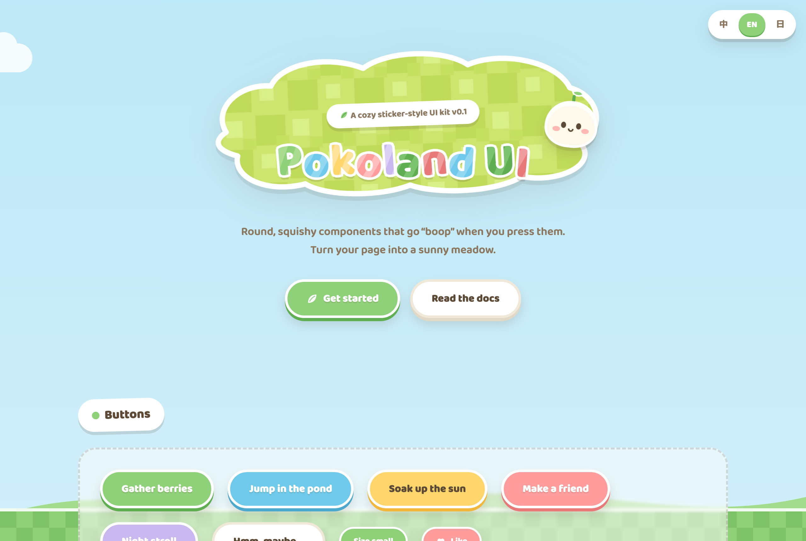

# Pokoland UI

English | **[简体中文](README.zh-CN.md)** | **[日本語](README.ja.md)**

> A cozy, sticker-style React component library with a zero-dependency CSS and vanilla JavaScript escape hatch.


**[Documentation](https://heminghaoa.github.io/pokoland-ui/)** · **[Vanilla demo](https://heminghaoa.github.io/pokoland-ui/demo/)**



## What it is

Pokoland UI is a typed React 18+ component library inspired by cozy, handcrafted interfaces:

- thick white outlines that make components feel like cut-out stickers;
- physical press, hover, focus, disabled, and reduced-motion states;
- a sunny meadow palette exposed through CSS custom properties;
- 25 original SVG icons and no emoji in the shipped UI;
- complete TypeScript declarations with native DOM props;
- Chinese, English, and Japanese component documentation;
- zero runtime dependencies beyond the optional React peer.

The package also keeps its framework-agnostic stylesheet, SVG sprite, and vanilla interaction entry points.

## Install

```bash
npm install pokoland-ui
```

```tsx
import { Button, Icon, IconSprite } from 'pokoland-ui';
import 'pokoland-ui/styles.css';

export function App() {
  return (
    <>
      <IconSprite />
      <Button color="sky" burst="splash">
        <Icon name="drop" />
        Jump in
      </Button>
    </>
  );
}
```

Render `IconSprite` once near the root when using `Icon`. Every component forwards the relevant native attributes, so standard labels, events, refs, and ARIA attributes remain available.

## Package entry points

| Import | Purpose |
| --- | --- |
| `pokoland-ui` | React components, helpers, and TypeScript types |
| `pokoland-ui/styles.css` | Theme tokens and component styles |
| `pokoland-ui/vanilla` | Optional toast, tabs, dialog, i18n, and burst helpers |
| `pokoland-ui/icons.svg` | Standalone Pokoland icon sprite |

All visual tokens live in `:root` CSS variables, so colors, radius, shadows, and motion can be rethemed without rebuilding the package.

## Documentation

The [component field guide](https://heminghaoa.github.io/pokoland-ui/) contains live examples, copyable React snippets, props tables, and accessibility notes for the complete public API. Switch 中文 / EN / 日本語 from any page; hash-based URLs work directly on GitHub Pages.

For projects that do not use React, start with the [zero-dependency demo](https://heminghaoa.github.io/pokoland-ui/demo/) and the [vanilla component notes](docs/components.md).

## Development

Pokoland UI uses [Bun](https://bun.sh) for development and release automation.

| Command | What it does |
| --- | --- |
| `bun run dev` | Serve the docs and demo at `localhost:4178` |
| `bun run check` | Check UI emoji and trilingual demo coverage |
| `bun test` | Run React, package, and documentation tests |
| `bun run build` | Build npm output, documentation, demo, and Pages artifact |
| `npm pack --dry-run` | Inspect the exact npm package payload |

See [CONTRIBUTING.md](CONTRIBUTING.md) for component, test, accessibility, translation, and IP requirements.

## Name, inspiration, and IP

The name **Pokoland** comes from the Japanese onomatopoeia *poko-poko* (ぽこぽこ), evoking the soft sound of a squishy button. The mood is inspired by cozy life-simulation games. All designs, colors, characters, icons, and copy are original. Pokoland UI is an unofficial fan-spirited project: it is not affiliated with or endorsed by Nintendo or The Pokémon Company and contains no official assets. Contributions must follow the same rule.

## License

[MIT](LICENSE) © 2026 Pokoland UI Contributors
