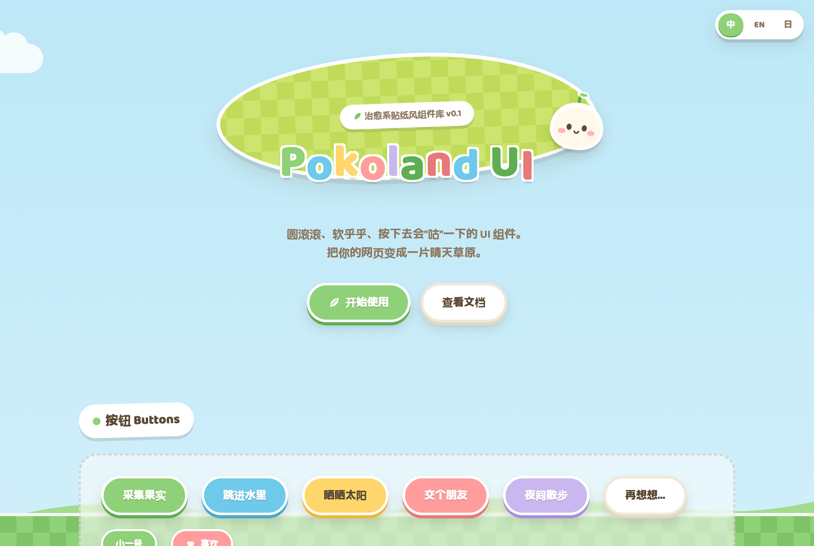

# 🏝️ Pokoland UI

**[English](README.md)** | 简体中文 | **[日本語](README.ja.md)**

> 圆滚滚、软乎乎、按下去会"咕"一下的治愈系贴纸风 UI 组件库。
> A cozy, sticker-style UI kit inspired by life-sim games. Squishy buttons included.

**框架无关** —— 纯 CSS,丢进 React / Next.js / 任何技术栈都能用。


## ✨ 这是什么

Pokoland UI 是一套**贴纸美学(Sticker Aesthetic)**的网页组件库:

- 🏷️ **厚白描边** —— 每个组件都像一张剪下来的贴纸
- 🎈 **充气手感** —— 按钮有物理厚度,按下去会真的"沉"下去
- 🌈 **晴天草原配色** —— 天空蓝 / 草地绿 / 奶油底 / 黄油黄 / 珊瑚粉
- 🍃 **微旋转排版** —— 组件带 1°~2° 的随机倾斜,像手工贴上去的
- 🐸 **弹簧动效** —— 所有交互使用 `cubic-bezier(.4, 1.6, .4, 1)` 的过冲曲线

适合用在:独立游戏官网、儿童/教育产品、宠物类应用、个人博客、任何想让人"哇好可爱"的地方。

## 🚀 快速开始

**线上 Demo:** https://heminghaoa.github.io/pokoland-ui/demo/(右上角可切 中/EN/日)



目前是纯 HTML + CSS + 原生 JS 的单文件 demo,零依赖:

```bash
# 直接用浏览器打开
open demo/index.html
```

所有设计令牌都在 `:root` 的 CSS 变量里,改一处即可全局换肤:

```css
:root {
  --meadow: #8FD178;  /* 换成你喜欢的颜色 */
}
```

## 📦 组件清单

| 组件 | 状态 | 组件 | 状态 |
|------|------|------|------|
| Button(6 色 / 2 尺寸) | ✅ | Tabs(路牌式) | ✅ |
| Badge | ✅ | Tooltip | ✅ |
| Input / Select / Textarea | ✅ | Dialog | ✅ |
| Switch(弹簧感) | ✅ | Toast | ✅ |
| Checkbox / Radio | ✅ | Avatar | ✅ |
| Progress(藤蔓生长条) | ✅ | Pagination | 🌱 计划中 |
| Slider | ✅ | Skeleton(种子发芽) | 🌱 计划中 |
| Card(图鉴卡) | ✅ | Calendar | 🌱 计划中 |

详细设计规范见 [docs/design-tokens.md](docs/design-tokens.md),组件用法见 [docs/components.md](docs/components.md),路线图见 [ROADMAP.md](ROADMAP.md)。

## 🗺️ 项目结构

```
pokoland-ui/
├── demo/                         # 完整可交互的组件展示页
├── src/
│   ├── pokoland.css              # 核心样式
│   ├── pokoland.js               # Toast / Tabs / Dialog / i18n
│   └── icons.svg                 # Pokoland Icons 图标集(20 个)
├── scripts/
│   ├── serve.ts                  # 开发服务器(bun run dev)
│   ├── build.ts                  # 构建 & 同步图标(bun run build)
│   └── check.ts                  # 零 emoji 扫描 + i18n 覆盖(bun run check)
├── docs/                         # 设计规范与组件文档
├── .github/workflows/pages.yml   # GitHub Pages 自动部署
├── package.json
├── README.md                     # 英文(默认入口)
├── README.zh-CN.md               # 简体中文
├── README.ja.md                  # 日本語
├── CONTRIBUTING.md               # 贡献指南
├── ROADMAP.md                    # 路线图
└── LICENSE                       # MIT
```

## 🤝 参与贡献

欢迎任何形式的贡献——新组件、配色主题、文档翻译、或者只是来 issue 区聊聊"这个按钮还能更 Q 弹吗"。请先阅读 [CONTRIBUTING.md](CONTRIBUTING.md)。

## ⚖️ 命名、灵感与 IP

**Pokoland** 这个名字来自日语拟声词「ぽこぽこ」——软软的按钮按下去那声噗叽就是它。视觉氛围灵感来自治愈系生活模拟游戏,特别是《Pokémon Pokopia》。**所有设计、配色、图形与文案均为原创。** Pokoland UI 是一个非官方的粉丝精神创作项目,与任天堂、宝可梦公司无关联、无背书,不包含任何官方素材。贡献者同样遵守此原则。

## 📄 License

[MIT](LICENSE) © 2026 Pokoland UI Contributors
